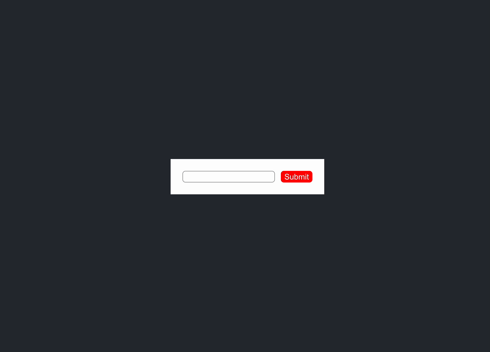

# React Visitor pattern implementation

### Demo


### Components

- Higher-order component `withWisitor` [ [link](src/visitor/with-visitor.js) ]
- Visitor `on` [ [link](src/visitor/on.js) ]
- Visitor `once` [ [link](src/visitor/once.js) ]
- Visitor `inView` [ [link](src/visitor/in-view.js) ]


### Usage

```javascript
import { on, inView, withVisitor } from './visitor'

const Form = withVisitor(({ emit }) => (
	<form
		className="form"
		onSubmit={emit.bind(null, 'submit')}
		ref={emit.bind(null, 'render')}
	>
		<input
			className="form__input"
			name="text"
			onBlur={emit.bind(null, 'blur')}
			onChange={emit.bind(null, 'input')}
			onFocus={emit.bind(null, 'focus')}
			type="text"
		/>

		<input
			className="form__submit"
			type="submit"
		/>
	</form>
))

const App = () => (
	<Form
		accept={[
			on('focus', () => { /* add outline for input */ }),
			on('blur', () => { /* remove outline for input */ }),
			on('submit', () => { /* process form data */ }),
			inView({
				enter: () => { /* revert body background color */ },
				leave: () => { /* change body background color */ },
				stream: async(asyncIterable) => {
					for await (const [ eventName ] of asyncIterable) {
						console.log('inView stream event:', eventName);
					}
				}
			})
		]}
	/>
)
```
